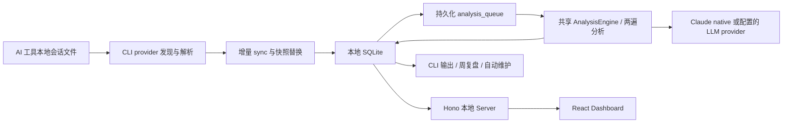

# 本地 Code Insights 项目概览

> 调研日期：2026-08-10
> 调研范围：本地仓库当前工作树、源码、项目文档、测试、package scripts 与 Git 历史
> 证据原则：只使用仓库内一手资料；如文档与当前源码冲突，以当前源码为准

## 结论先行

Code Insights 是一个面向 AI 编程用户的、本地优先的个人复盘工具。它从 Claude Code、Cursor、Codex CLI、GitHub Copilot CLI 和 VS Code Copilot Chat 的本机会话文件中抽取会话、消息、决策、经验、提示词质量和行为模式，把结果存入本地 SQLite，再通过终端和 React Dashboard 展示。它不要求注册账号，也没有产品自建的云同步；只有用户主动配置远程 LLM 时，经过凭据脱敏的会话内容才会离开本机。产品边界是“个人学习工具”，不是团队监控平台。证据：`README.md:15-18,28-33`，`docs/PRODUCT.md:3-35`，`docs/VISION.md:5-11,121-127`。

项目已经越过 MVP：五种来源适配器、统一分析引擎、持久化任务队列、两遍原子分析、Dashboard、自动维护、周复盘和安全边界都已存在。近期开发重点不是继续铺功能，而是在收紧历史重分析、LLM 结构化输出容错、隐私脱敏、队列一致性和自动维护的可靠性；近期少数明显的产品功能是 Session Passport 页面。Git 证据：`999aa1f`、`fa4a2da`、`8f48d3a`、`4a1c080`、`ec5cb52`、`18d3fc4`、`9751e3e`。

必须把三个状态分开：

1. **已发布版本**：包清单和最新 tag 都是 `v4.11.0`。证据：`cli/package.json:1-4`，Git tag `v4.11.0`。
2. **当前已提交源码**：HEAD 为 `9751e3e`，`git describe` 为 `v4.11.0-37-g9751e3e-dirty`，即 tag 之后还有 37 个提交。
3. **当前未提交工作**：分支 `fix/session-analysis-retry` 相对 `fork/fix/session-analysis-retry` ahead 1，另有 10 个已跟踪文件修改，以及 `design-qa.md` 和 `qa/session-passport/` 等未跟踪内容。因此本报告不能把当前工作树描述为正式发布状态。

## 1. 产品目标与目标用户

### 1.1 要解决的问题

AI 编程会话通常散落在不同工具的本地日志里。用户完成任务后，很难回看“做了什么决策、哪里反复卡住、提示词为何有效或无效、哪些经验值得复用”。Code Insights 将这些原始会话转换成可检索、可比较的学习记录。证据：`docs/PRODUCT.md:3-18`。

产品输出主要包括：

- 会话摘要、关键决策与经验；
- 提示词质量总分，以及 `context_provision`、`request_specificity`、`scope_management`、`information_timing`、`correction_quality` 五个维度（界面名为 Context、Clarity、Focus、Timing、Orchestration）；
- outcome satisfaction、workflow、course correction、friction points、effective patterns 等 facets；
- 跨会话 recurring insights、Analytics 和周度 Journal。证据：`docs/PRODUCT.md:80-139,197-202`，`dashboard/src/App.tsx:151-175`。

### 1.2 目标用户

- 同时使用多种 AI 编程工具、希望统一回看的开发者；
- 想改善提示词和问题拆解方式的学习者；
- 不愿把完整代码对话交给新 SaaS 平台的隐私敏感用户。证据：`docs/PRODUCT.md:21-35`。

产品明确选择“本地工具，而不是托管平台”。团队版、BYOS Supabase、组织级聚合仍是讨论稿，文档明确要求 founder 决策，且设想中也不应同步原始 transcript。不能把它们当成已承诺路线图。证据：`docs/VISION.md:121-177`。

## 2. 总体架构与关键数据流

仓库是一个 pnpm monorepo，核心 workspace 为 `cli/`、`server/` 和 `dashboard/`；根构建顺序固定为 CLI → Server → Dashboard。证据：`pnpm-workspace.yaml`，`package.json:5-12`。



概览证据：`README.md:249-287`，`docs/ARCHITECTURE.md:7-18`。

### 2.1 同步数据流

1. CLI 注册 Claude、Cursor、Codex、Copilot CLI 和 VS Code Copilot Chat 五个 `SessionProvider`。每个 provider 负责发现文件、生成指纹和解析成统一会话模型。证据：`cli/src/providers/types.ts:3-21`，`cli/src/providers/registry.ts:1-24`。
2. `sync` 初始化数据库，按来源和项目发现文件，并用主文件/WAL 的 mtime + size signature 筛掉未变化文件。证据：`cli/src/commands/sync.ts:55-99,127-224`。
3. 解析成功后，单个来源文件的会话快照整体替换；只有数据库写入成功才推进同步 checkpoint。这样可以避免进程崩溃后把“未落库”误记为“已同步”。证据：`cli/src/commands/sync.ts:244-343`。
4. 同步结束会协调来源状态、统计和数据库 generation，供 Dashboard 判断缓存是否失效。证据：`cli/src/commands/sync.ts:421-459`，`cli/src/db/client.ts:78-118`。

### 2.2 分析数据流

配置型 LLM 的标准路径是“两遍、冻结输入、一次发布”：

1. 对 session 与 messages 计算精确 `input_revision`，冻结本次分析输入；
2. 第一遍生成摘要、决策、经验和 facets；
3. 第二遍基于同一冻结输入生成 prompt-quality 评分和改进建议；
4. 发布前再次确认数据库里的会话 revision 没变化；
5. 只有两遍都成功，才在一个 SQLite transaction 内一次性发布 insights、prompt quality、facets、usage 和 title。证据：`cli/src/analysis/two-pass-analysis.ts:128-171,296-377,382-520,541-609`。

这意味着正常配置型分析每个 session 至少产生两次 LLM 调用；长会话切块、格式纠错或瞬时故障重试会增加调用次数。证据：`README.md:147-183`，`cli/src/analysis/analysis-engine.ts:91-125,259-300,467-639`。

共享 `AnalysisEngine` 还提供 token budget、对话截断、长会话切块、去重、JSON 修复、一次结构化输出纠错和 partial-failure 处理。证据：`cli/src/analysis/llm-client.ts:66-192`，`cli/src/analysis/analysis-engine.ts:259-300,467-639`，`cli/src/analysis/response-parsers.ts:390-453`。

### 2.3 Hook 与持久化队列数据流

Claude Code `SessionEnd` hook 读取 stdin，先在前台同步刚结束的会话文件，再把分析任务写入 SQLite 队列，最后启动 detached worker。Hook 本身不等待完整 LLM 分析。证据：`cli/src/commands/session-end.ts:1-15,45-124`。

队列会合并同一 session 的重复请求；worker 用原子 claim 取得当前可执行的最早任务，失败后按退避策略重试，超过预算后进入 terminal failure，并可回收租约超时的 stale job。当前 claim 还会隔离未完成的历史重分析 campaign。证据：`cli/src/db/queue.ts:1-14,96-148,246-282,341-473`。

Server 的 queue pump 每轮只处理一个 item，再让出事件循环；失败时持久化下一次尝试时间，因此 Dashboard 关闭或进程重启后队列状态不会凭空消失。证据：`server/src/analysis/queue-pump.ts:27-39,55-123`。

## 3. 四个运行面的职责

### 3.1 CLI：采集、编排和本地运维入口

CLI 是产品的控制面和数据入口。它负责：

- `init`、`sync`、`status`、`doctor` 等本地生命周期；
- `dashboard` / 默认命令启动 Web UI；
- `install-hook`、`session-end`、`queue` 和 LLM lock；
- `insights`、`reanalyze`、`reflect`、`maintenance` 等分析与复盘；
- provider 发现/解析、SQLite migration、配置与同步 checkpoint。证据：`cli/src/index.ts:29-49,91-210`。

无参数运行会先自动 sync，再启动 Dashboard；启动方式会在开发构建、npm 内嵌产物等模式间解析 Server 与 SPA 路径。证据：`cli/src/commands/dashboard.ts:49-66,93-135`。

`install-hook` 只维护一个 Claude `SessionEnd` hook，并通过临时文件和 rename 安全写回 settings。它可选择 native Claude 或配置型 provider。证据：`cli/src/commands/install-hook.ts:193-267`。

### 3.2 Server：本机 API、安全边界与后台调度

Server 基于 Hono，提供 projects、search、sessions、messages、insights、analysis、queue、analytics、config、export、telemetry、facets、reflect 等 API，并托管 Dashboard 静态文件。证据：`server/src/index.ts:47-170`。

它同时承担三项关键职责：

- 把 SQLite 数据转换成 Dashboard API；
- 提供单 session 分析、批量队列、SSE/状态查询和 recurring insights；
- 在本机进程内运行 queue pump。证据：`server/src/routes/analysis.ts:66-243`，`server/src/routes/analysis-queue.ts:20-75`，`server/src/analysis/queue-pump.ts:55-123`。

Server 绑定 `127.0.0.1`，并用 Host/Origin 校验和随机 32-byte bearer token 防止浏览器跨站请求直接调用本地 API。证据：`server/src/index.ts:164`，`server/src/security/local-dashboard-security.ts:16-37,52-124`。

### 3.3 Dashboard：浏览、解释和触发分析

Dashboard 是 React 19 + React Query + Vite 应用。主要页面包括首页、Sessions/Session Passport、Insights、Analytics、Patterns、Settings、Export 和 Journal，路由采用 lazy load。证据：`dashboard/src/main.tsx:11-37`，`dashboard/src/App.tsx:10-21,151-175`。

它只向同源相对 `/api` 发请求。启动时从 bootstrap endpoint 取得进程级 token，token 只保存在内存；如果 Server 轮换 token，会刷新一次并重试。证据：`dashboard/src/lib/dashboard-http.ts:15-45,80-100`，`dashboard/src/lib/api.ts:1-24`。

分析队列活跃时，前端约每 5 秒轮询；队列排空后会失效 session 与 insight 相关查询。localStorage 中保存的是批处理 receipt，不是 API token。证据：`dashboard/src/hooks/useAnalysisQueue.ts:145-188`。

### 3.4 Automation：低峰期串行维护与告警

`automation/install-launchd.sh` 在 macOS 安装每日 LaunchAgent，默认凌晨 02:00–06:00 低优先级执行。证据：`automation/install-launchd.sh:1-17,140-149`，`automation/com.code-insights.maintenance.plist.in:8-49`。

维护脚本在同一把全局锁下按顺序执行 sync、持久化队列 drain、历史重分析 campaign、受限旧批次分析和周度 reflect。周复盘只处理前一完整 ISO 周，并要求至少 8 个 facets。证据：`automation/code-insights-maintenance.sh:193-310,348-460,462-530`。

Runner 会保留子进程退出码，并在结束后 best-effort 发送当前 campaign 告警；TeamTalk 告警脚本使用私有权限检查、事件 ID 和本地 durable outbox，避免临时网络失败直接丢通知。证据：`automation/code-insights-maintenance-runner.sh:48-60,95-140,168-177`，`README.md:207-235`。

这套 scheduler 明确是 macOS LaunchAgent 实现；仓库没有等价的 systemd、cron 安装器或 Windows Task Scheduler 集成。

## 4. 数据存储、隐私与安全

### 4.1 本地持久化

默认数据目录由配置路径解析，核心资产包括 SQLite、`config.json` 和 sync checkpoint。目录权限设为 `0700`，配置与 checkpoint 设为 `0600`。SQLite 启用 WAL、foreign keys 和 `busy_timeout`，启动时自动迁移。证据：`cli/src/db/client.ts:7-36`，`cli/src/utils/config.ts:6-17,43-84`。

主要表包括 projects、sessions、messages、insights、facets、analysis_usage、analysis_queue、analysis_campaigns、analysis_campaign_snapshots 和数据库 identity/generation。**当前真实 schema 版本是 V13**。证据：`cli/src/db/schema.ts:1-5,10-128,131`，`cli/src/db/migrate.ts:15-32,157-194,219-425`。

V13 的核心变化是给历史分析 campaign item 的 claim 增加唯一 `claim_token` fencing，降低旧 worker 在租约失效后错误覆盖新 worker 结果的风险；它不是普通 `analysis_queue` 的 migration。证据：`cli/src/db/migrate.ts:417-425`。

### 4.2 什么会离开本机

- 只做 sync、浏览或使用本地 endpoint 时，原始会话与 SQLite 留在本机；
- 配置 OpenAI、Anthropic、Gemini 或远程兼容 endpoint 后，分析所需内容会发送给该 provider；
- `--native` 通过本机安装的 `claude -p` 运行，数据边界由 Claude Code 自身的认证与服务策略决定；
- Ollama、llama.cpp 只有在 endpoint 仍是 local URL 时才能视为本地。证据：`docs/SECURITY-MODEL.md:24-33,63-80`，`cli/src/constants/llm-providers.ts:91-158`，`cli/src/analysis/native-runner.ts:1-9,115-203`。

所有配置型 provider 请求都会经过 outbound credential guard。它识别已知 provider token、Authorization/Cookie/header、URL credential 等类别；未知 provider 默认 fail closed。模型返回结果在写入数据库前也会再次脱敏。证据：`server/src/llm/client.ts:50-106`，`cli/src/analysis/provider-runner.ts:424-509`，`cli/src/privacy/outbound-credential-guard.ts:63-95,775-900`，`cli/src/analysis/response-parsers.ts:390-453,564-597`。

这里有三个不能忽略的边界：

1. guard 是模式驱动的保护层，不是完备的 secret scanner，未知格式仍可能漏检；
2. 本地原始 transcript、SQLite 和 API key 不是加密存储，只依赖用户目录与文件权限；
3. loopback token 防网页跨站攻击，但不能防同一操作系统账号下的恶意进程。证据：`docs/SECURITY-MODEL.md:35-61,82-110,143-158`。

Telemetry 使用 PostHog，默认开启但可 opt out；事件名和属性经过 allowlist/sanitize，distinct ID 是主机名与用户名的稳定哈希，provider 检测只报告目录存在性，不读取会话内容。证据：`cli/src/utils/telemetry.ts:10-17,42-157,365-428`，`docs/SECURITY-MODEL.md:112-141`。

## 5. LLM provider 与分析机制

### 5.1 支持的 provider

配置型 provider 包括 OpenAI、Anthropic、Gemini、Ollama 和 llama.cpp；另有 `claude -p` native runner。模型、价格和默认 endpoint 目录都在源码静态维护。证据：`cli/src/constants/llm-providers.ts:7-70`，`server/src/llm/client.ts:19-106`。

自定义 base URL 受到协议和凭据校验；远程 Anthropic-compatible HTTP 被拒绝，URL 内嵌 credential 被拒绝，本地 endpoint 有受控豁免。证据：`cli/src/constants/llm-providers.ts:91-158`。

native runner 不经 shell 拼接，而是 `execFileSync('claude', args)`，system prompt 写入临时文件，user prompt 从 stdin 传入，cwd 隔离到系统临时目录，并设置 hook recursion guard；它兼容新版单 result object 和旧版 event array。证据：`cli/src/analysis/native-runner.ts:1-9,57-107,115-203`。

### 5.2 输出可靠性

分析要求 JSON/JSON Schema 输出。解析器按“直接解析 → fenced JSON 抽取 → `jsonrepair` → 有限 salvage → schema validation”的路径恢复结构化结果；格式仍不合法时触发一次纠错请求。当前两遍分析只有全部成功才可见，避免出现新 session insight 配旧 prompt-quality 的混合代际。证据：`cli/src/analysis/response-parsers.ts:390-453`，`cli/src/analysis/analysis-engine.ts:91-125`，`cli/src/analysis/two-pass-analysis.ts:541-609`。

历史重分析使用 campaign、冻结 revision、provider/model/pipeline revision 和 usage 记录来判断可恢复性，目的是在限流、进程重启或某个 session 暂时失败时继续推进，而不是整批重来。证据：`cli/src/analysis/two-pass-analysis.ts:128-171`，`cli/src/db/migrate.ts:341-414`，Git 提交 `a3357bb`、`9d2a550`、`999aa1f`、`8f48d3a`。

## 6. 安装、运行、开发与测试

### 6.1 普通使用

```bash
# 无需全局安装
npx @code-insights/cli

# 或全局安装
npm install -g @code-insights/cli
code-insights

# 安装 Claude Code SessionEnd hook
code-insights install-hook
```

无参数 `code-insights` 会同步后打开 Dashboard，默认地址为 `http://localhost:7890`。证据：`README.md:113-143`，`cli/README.md:27-52`。

### 6.2 从源码开发

支持 Node 20、22 和 24+，pnpm 固定为 9.15.9。标准流程：

```bash
corepack enable
pnpm install --frozen-lockfile
pnpm typecheck
pnpm test
pnpm build
cd cli && npm link
code-insights --version
```

证据：`README.md:289-302`，`CONTRIBUTING.md:5-26`，`package.json:14-20`。

开发 watch 命令分别是 `cd cli && pnpm dev`、`cd server && pnpm dev`、`cd dashboard && pnpm dev`。根 `pnpm dev` 只启动 CLI TypeScript watcher；Server 的 `dev` 也只是编译 watcher，并非独立产品 server。完整体验应先 build/link，再运行 `code-insights dashboard`。证据：`CONTRIBUTING.md:62-73`，`package.json:5-12`，`server/package.json:10-16`。

### 6.3 测试与 CI

根 `pnpm test` 先执行 7 个 automation shell tests，再递归运行 CLI、Server 和 Dashboard 测试。`pnpm typecheck` 会先真正构建 CLI；`pnpm test:coverage` 只覆盖 CLI 与 Server，不含 Dashboard。证据：`package.json:5-12`。

静态清点有 59 个 CLI、32 个 Server、25 个 Dashboard 测试文件，以及 7 个 automation shell 测试文件。CI 在 Ubuntu + Node 20 上执行 install、typecheck、build 和普通 test。证据：`.github/workflows/ci.yml:12-44`。

本次调研**没有宣称当前测试通过**：当前工作树本来就有未提交改动，而 `pnpm typecheck` / build 会删除并重建 `cli/dist`。为遵守“不触碰已有文件”的约束，本次没有执行 build、test 或 coverage，只核验了命令、测试源码与 CI 配置。证据：`cli/package.json:47-65`，`docs/QA.md:237-243`。

## 7. 路线图与近期开发状态

### 7.1 路线图

Roadmap 把主要产品 phase 标记为完成，当前明确列出的下一步是：

1. 周维度进步追踪；
2. friction-to-pattern 关联图；
3. 扩充 Vitest 测试；
4. 跨工具会话合并；
5. Stats / Milestone 分享卡。证据：`docs/ROADMAP.md:9-24,241-290`。

早期遗留项包括自动生成 Learning Journal、Claude `/insights` slash command 和插件架构。当前 Dashboard 已有 Journal 页面，因此 Roadmap 的 Journal 表述可能指更深的自动归纳，也可能只是状态未同步，需产品负责人澄清。证据：`docs/ROADMAP.md:20-24`，`docs/PRODUCT.md:197-202`。

`.code-insights.md`、`code-insights context`、Team Knowledge Sync、Stats/Milestone Card 和 Progress Tracking 都只存在于 deferred/future 设计文档，不能当作现有功能。证据：`docs/plans/2026-05-05-codebase-knowledge-design.md:1-17`，`docs/plans/2026-03-08-gamification-shareable-badges.md:3-4,39-48`，`docs/plans/2026-03-09-effective-pattern-normalization.md:3-10,360-408`。

### 7.2 最近开发重心

从 2026-07 到当前 HEAD，主要提交集中在：

- 可恢复、有界、串行的历史分析：`a3357bb`、`9d2a550`、`999aa1f`、`8f48d3a`；
- 凭据脱敏与同步/分析一致性：`fa4a2da`、`a5aab94`；
- malformed/structured output 与 campaign retry：`0d2ac1c`、`4a1c080`、`ec5cb52`、`9751e3e`；
- 双语分析和 Dashboard：`bdcbcae`；
- Session Passport：`18d3fc4`。

`docs/implementation/CURRENT_SPRINT.md:1-3` 写着没有 active sprint，但当前分支和 dirty diff 显示仍有开发进行，因此它只能说明没有正式登记的 sprint，不能说明仓库静止。

当前未提交修改主要在解决两个问题：其一，历史 campaign 已耗尽重试的失败项不应阻塞 campaign 外普通分析，但仍应暂停 reflection；其二，已经规范化的 `[REDACTED:authorization]` 不应再次被当成秘密，但 placeholder 后残留的新秘密仍必须阻止持久化。证据：`cli/src/commands/reanalyze.ts:64-75,294-308`，`throttled-analyze.sh:165-190`，`automation/code-insights-maintenance.sh:488-521`，`cli/src/privacy/outbound-credential-guard.ts:532-555`，`cli/src/analysis/history-refresh-db.ts:257-270`。这些都是未提交状态，不代表 v4.11.0。

## 8. 文档漂移：必须以当前源码为准

### 8.1 Schema 版本漂移

当前源码明确是 `CURRENT_SCHEMA_VERSION = 13`，migration 也包含 V13 history-analysis campaign-item claim-token fencing。证据：`cli/src/db/schema.ts:131`，`cli/src/db/migrate.ts:417-425`。

但多份文档仍停留在旧版本：

- `CLAUDE.md:151`：V11；
- `docs/PRODUCT.md:383`：V11；
- `docs/QA.md:40,68,247-252`：V11；
- `docs/VISION.md:108`：V11；
- `docs/ARCHITECTURE.md:118,131-137`：最多写到 V12。

因此任何迁移设计、测试基线或故障排查都应以 `schema.ts` 与 `migrate.ts` 为事实源，而不是复制上述文档中的版本号。

### 8.2 Codex parser 状态漂移

`docs/source-tool-format-analysis.md:1-16,208-229` 是一次历史格式审计，仍把 Codex parser 写成 “broken”。这已经不代表当前实现。

Git 历史显示 Codex parser 在 2026-03-02 由提交 `16748c8` 重写，并在 `bee6789`、`cc0a21e`、`a5aab94` 等提交继续修复。当前 `cli/src/providers/codex.ts:8-15,21-43,175-185,252-470` 同时处理 legacy/current 文件、user/assistant、function/custom tool call/result、reasoning 和 task-complete 等事件；`cli/src/providers/codex.test.ts:73-90` 及同文件后续案例覆盖了正常用户/助手消息和更多变体。结论应是“旧审计指出的问题已被后续重写解决，仍需通过 fixtures 持续防格式漂移”，而不是“当前 Codex 不可用”。

### 8.3 其他漂移信号

- `docs/DEVELOPMENT.md:192-199` 暗示有 lint script，但当前根与各 package scripts 都没有 lint gate；证据：`package.json:5-13`，`cli/package.json:47-58`。
- `docs/ARCHITECTURE.md:459-467` 的文件行数和 response-parser 所在层已经落后于重构，债务清单需重新审计。
- `docs/DEVELOPMENT.md:185-188` 说 `--hook` 已移除；当前 CLI 仍保留该 flag 作为兼容错误入口，调用时明确提示改用 `install-hook`，不是有效分析模式。证据：`cli/src/index.ts:180-184`，`cli/src/commands/insights.ts:166-192`。
- package/CHANGELOG 仍是 v4.11.0，但 HEAD 已在 tag 后 37 commits；若准备新发布，需要统一版本、CHANGELOG 与产品文档。证据：`cli/package.json:1-4`，`cli/CHANGELOG.md:1-6`，`git describe --tags`。

## 9. 明显风险与待办

以下分为“源码可直接确认”和“基于源码的推断”，避免把审计线索写成已复现故障。

### P0/P1：发布与数据安全边界

1. **先收口 dirty branch，再谈发布。** 当前有未提交队列、automation 和 credential-guard 逻辑，且 tag/CHANGELOG 未前移；应先跑完整验证、审查 diff、决定版本并更新文档。
2. **本地数据未加密。** SQLite、原始 transcript 派生数据和 API key 依赖文件权限；共享账号、恶意本地进程和备份泄露不在现有保护范围。证据：`docs/SECURITY-MODEL.md:143-158`。
3. **脱敏不是完备 secret detection。** 继续增加凭据 fixtures、未知格式 fail-closed 测试和返回值持久化测试，尤其是自定义兼容 endpoint。证据：`docs/SECURITY-MODEL.md:82-110`。

### P1：可靠性与测试门槛

4. **Coverage floor 与文档目标不一致。** Provider 当前 floor 约为 statements 38% / branches 32%，DB 约 81% / 69%，utils 约 63% / 53%；Server pricing floor 也低，Dashboard 没有 coverage script。证据：`cli/vitest.config.ts:12-40`，`server/vitest.config.ts:12-38`，`dashboard/package.json:7-13`，`docs/DEVELOPMENT.md:107-117`。
5. **CI 不执行 coverage gate。** CI 只运行普通 test；`pnpm test:coverage` 没有进入 workflow。证据：`.github/workflows/ci.yml:33-44`，`package.json:8-12`。
6. **CI 矩阵窄。** package 宣称支持 Node 20、22、24+，但 CI 只跑 Ubuntu + Node 20；五种来源格式、macOS hook/LaunchAgent 和 Windows 路径都缺真实 OS matrix。证据：`package.json:14-20`，`.github/workflows/ci.yml:12-29`。
7. **核心 analysis coverage 可能漏管。** Server 的 response parser/pricing 已变成 CLI 实现的 re-export，但 CLI threshold 只列 providers/db/utils，没有等价覆盖 `cli/src/analysis/**`。证据：`server/src/llm/response-parsers.ts:1-8`，`server/src/llm/analysis-pricing.ts:1-9`，`server/vitest.config.ts:32-38`，`cli/vitest.config.ts:15-40`。

### P1/P2：文档、运维与长期漂移

8. **CLI 与 Server 仍有两套 LLM transport。** CLI 源码明确说明这是为避免循环依赖而复制，并用 Issue #240 跟踪统一；新增 provider、重试或安全策略时存在双处更新风险。证据：`cli/src/analysis/provider-runner.ts:1-11`，`server/src/llm/client.ts:50-106`。
9. **尽快做一次 docs-as-code 对齐。** 优先修 schema V13、Codex parser 状态、架构债务路径、lint/coverage 描述与 v4.11.0 后变更。否则排障者很容易按 V11 或“Codex broken”做错判断。
10. **模型目录在 CLI 与 Dashboard 重复且已经分叉。** Dashboard 源码自己维护 provider/model 列表并留有 TODO，它与 CLI 常量并非同一份事实源；模型名、价格和 endpoint 又都是静态值。建议抽出共享目录，并增加更新时间与无价格时的安全显示策略。证据：`dashboard/src/pages/SettingsPage.tsx:26-94`，`cli/src/constants/llm-providers.ts:7-70`。
11. **跨平台 automation 缺口。** 当前一键定时维护只覆盖 macOS LaunchAgent；Linux/Windows 用户只能自行编排。
12. **Journal 路线图口径需澄清。** UI 已有 Journal，但 Roadmap 仍列“自动生成 Learning Journal”；应把已交付页面与未交付生成能力拆开描述。

### 需要专项复现的审计线索

13. **Reflection snapshot 查询可能漏 source scope。** V11 起 snapshot 主键包含 `(period, project_id, source_scope)`，但维护脚本部分查询只按 period/project 过滤。如果同一项目同一周存在多 source scope 记录，shell 变量可能收到多行并导致 postcondition 误判。这是源码推断，尚未通过测试复现。证据：`cli/src/db/migrate.ts:314-325`，`automation/code-insights-maintenance.sh:397-416,447-450`。
14. **操作日志与真实队列顺序不一致。** maintenance 文案写 “newest first”，当前 queue claim 实际按 `enqueued_at ASC` 取最早任务。这是运维可观测性漂移，不一定影响正确性。证据：`automation/code-insights-maintenance.sh:193-196`，`cli/src/db/queue.ts:265-278`。

## 10. 建议的近期收口顺序

1. 在干净分支完成当前 retry / exhausted-failure / credential-placeholder 修改，并执行完整 `pnpm typecheck && pnpm test && pnpm build`；
2. 更新 schema、Codex parser、架构、QA、版本和 CHANGELOG 文档；
3. 将真实 `cli/src/analysis/**` 与 Dashboard 纳入 coverage 策略，并让 CI 实际执行 coverage gate；
4. 增加 Node 22/24 和关键 macOS/Windows 集成验证；
5. 专项验证 source-scoped reflection snapshot 与 queue 顺序日志；
6. 再从 Roadmap 中选择 progress tracking、跨工具合并或分享卡，避免在可靠性收口前同时扩张多个方向。

## 附录：本次状态核验说明

本报告写入前使用 `git status --short --branch`、`git describe --tags --always --dirty`、`git log` 和 `rg`/源码阅读核验状态。除新增本文件外，没有修改、覆盖、格式化、暂存或清理任何既有文件；也没有把未提交 QA 文档中的结论当成正式发布证明。
